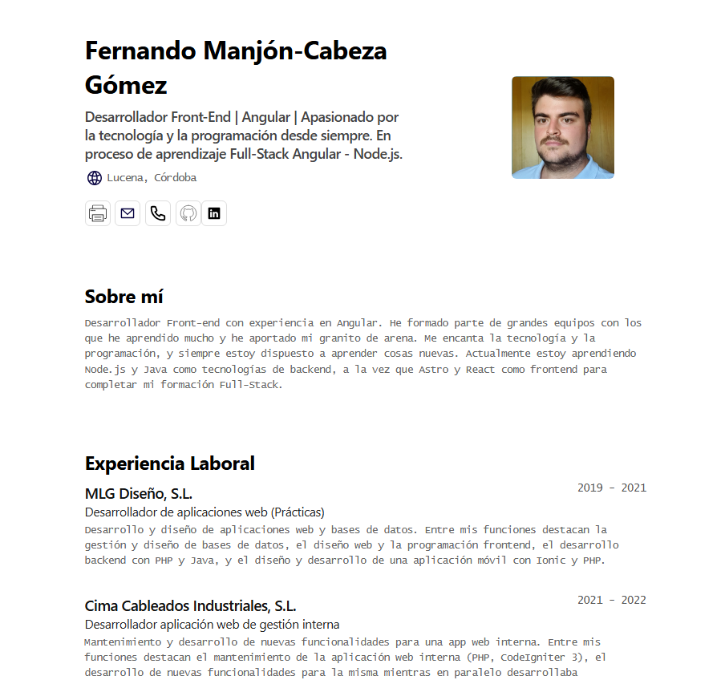

# Minimalist Portfolio JSON

Este es un proyecto de portafolio minimalista creado con Astro como primer contacto con el framework. El portafolio es fácil de editar modificando un archivo JSON, y tiene un diseño limpio y claro con la posibilidad de descargarlo en PDF.

🧞 Comandos
Todos los comandos se ejecutan desde la raíz del proyecto, desde una terminal:

<table>
  <thead>
    <td>Comando</td>
    <td>Acción</td>
  </thead>
  <tr>
    <td>npm install</td>
    <td>Instala las dependencias</td>
  </tr>
  <tr>
    <td>npm run dev</td>
    <td>Inicia el servidor de desarrollo en localhost:4321</td>
  </tr>
  <tr>
    <td>npm run build</td>
    <td>Construye el sitio de producción en ./dist/</td>
  </tr>
  <tr>
    <td>npm run preview</td>
    <td>Previsualiza tu construcción localmente</td>
  </tr>
  <tr>
    <td>npm run astro ...</td>
    <td>Ejecuta comandos CLI como astro add, astro check</td>
  </tr>
</table>	

  

📄 Configuración 
cv.json 
El archivo cv.json contiene toda la información del portafolio, como el nombre, la etiqueta, la imagen, la ubicación, los perfiles sociales, la experiencia laboral, la educación, las habilidades, etc. Puedes editar este archivo para actualizar la información mostrada en el portafolio.

🛠️ Componentes  
Los componentes están organizados en la carpeta src/components. Cada sección del portafolio es un componente separado en la carpeta sections. Los íconos están en la carpeta icons. 

💻 Layout 
El archivo src/layouts/Layout.astro define el diseño general del sitio. 

📄 Inspiraciones 
Este proyecto está inspirado en la idea de <a href="https://jsonresume.org/schema/">jsonresume.org</a>
Este proyecto utiliza las bases de <a href="https://github.com/midudev/minimalist-portfolio-json">Midudev</a>

🔑 Licencia  
MIT - Creado por fmangom292.
